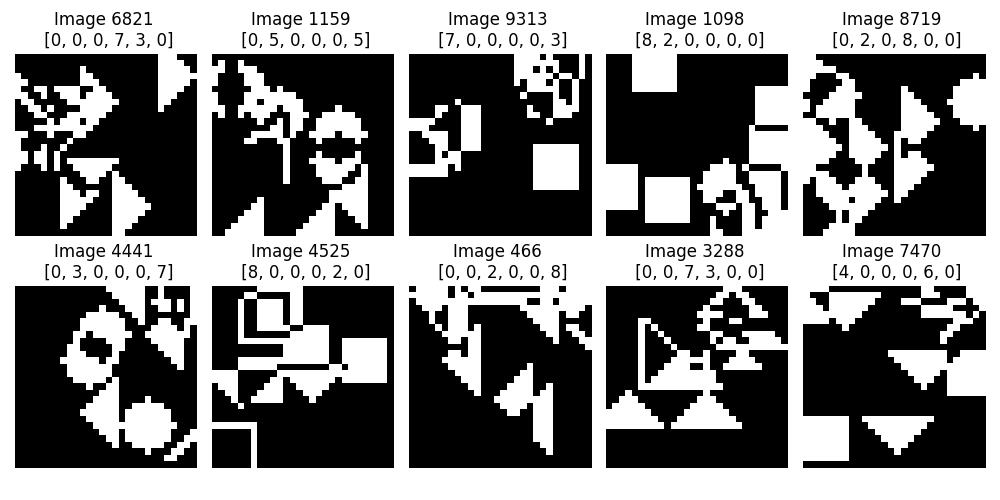
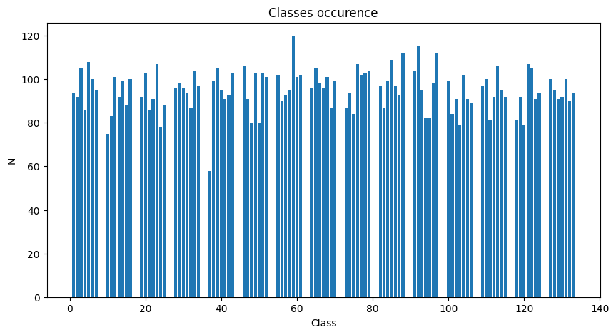
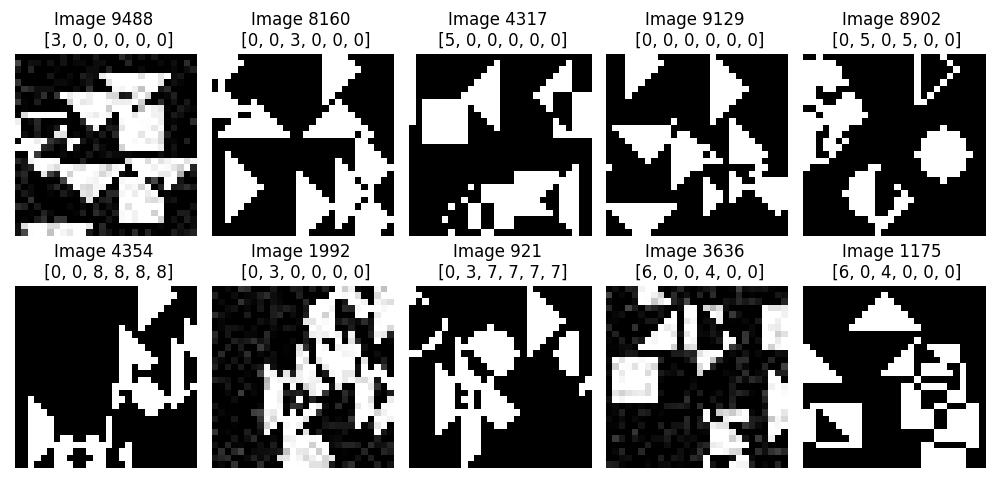
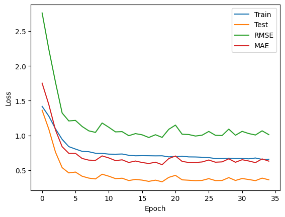
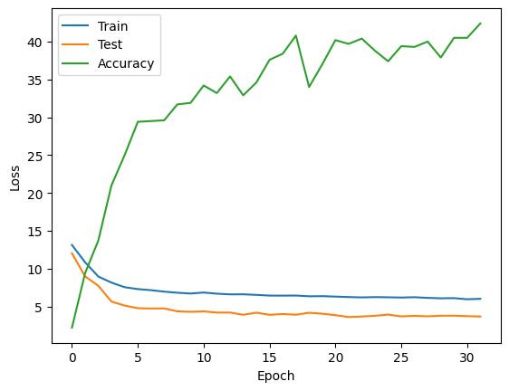

[Colab link](https://colab.research.google.com/drive/1VIIixwe9ZxKZZd-Wu6OPq14omoIRnNTA?authuser=0#scrollTo=gwEpAkZ1WQPH)

[Github link](https://github.com/quantumFeline/dnn-hw-1)

**Requirements**: cuda, ~3-5 min on gpu

Implementation of [this lab](https://colab.research.google.com/github/mim-ml-teaching/public-dnn-2025-26/blob/master/docs/hw_1_multitask_counting_student.ipynb).

Dataset exploration and augmentation
---

The dataset contains 10,000 28x28 images. some images examples:



For 6 types of figure, have can have (6x5/2)*9 = 135 possible classes. However, not all of them are present in the dataset, as can be seen on this graph:



So, in practice, the model only needs to differentiate between 105 different classes.

We will create a class `Dataset` to hold the necessary data, read the images and the labels, and transform the data into the suitable format.

For augmentation, we will make use of PyTorch native approach and introduce a separate class `Augmentation`, which can then be passed as a `transforms` parameters into the Dataset class. Here, we implement all augmentations - horizontal flip, vertical flip, rotation, gaussian noise, brightness, and erasing. For each of the augmentations, we choose a random subset of the dataset (0% by default) to apply the augmentation. This means that some images may have multiple augmentations applied, which is intended.

For rotation, as it is unspecified whether we use clockwise rotation, counter-clockwise, or both, we choose the direction on the rotation randomly for each image chosen for this augmentation type.

For Gaussian noise, we will use variance of 10% of the maximal value of the pixel.

After augmenting the example images from above, we can see that the labels have changed correspondingly where warranted:



Model architecture
---

We will keep the architecture in the class `ShapeClassifier`. For both heads, we want to keep them simple, as there are only 256 output features from the body, and adding more layers will not be particularly beneficial. However, with just a linear layer each, the model showed signs of significant overfitting (training loss exceeding the test loss more than five times).

Therefore, we will use a combination of a Dropout and a linear layer:

```
self.head_shapes = nn.Sequential(
            nn.Dropout(0.5),
            nn.Linear(256, 135))
self.head_counts = nn.Sequential(
    nn.Dropout(0.5),
    nn.Linear(256, 6))
```

Training
---

We defined three training loops for each experiment: classification-only, regression-only, and combined. We pass a different model, but use the same function that returns the losses collected.

These are the graphs of our training process:






In all cases, unless our randomly chosen priors were especially good, we see the test loss significantly below training loss; this is normal and is caused by our use of Dropout layer, which is turned off when in evaluation mode.

We experimented with different possible augmentations. Simple geometric augmentations, like flipping, seem to be beneficial, while Gaussian noise seems to lead to more unsteady training progress. In the end all augmentations have been included, but the occurrence of the more problematic ones was turned downwards.

Results
---

Overall performance for the classification model:

```angular2html
Cls: 1.5666 | Reg: 1.8045 | Total: 1.5666
Test Loss: 1.5666 | Test Acc: 42.80% | Precision: 0.4067 | Recall: 0.4144 | F1: 0.3782
```

Combined model:

```angular2html
Cls: 1.5593 | Reg: 0.3228 | Total: 3.4964
Test Loss: 3.4964 | Test Acc: 43.70% | Precision: 0.4525 | Recall: 0.4602 | F1: 0.4130
```

The `lambda = 6` loss coefficient for the model was chosen based on the values of the classification and regression loss during training, such that both head have roughly equal influence on the training.

We see that the combined model achieves mildly better results, however, the influences is minimal overall. What it influences more significantly is the training speed, with the model achieving the plateau faster.

Feature analysis shows a significant amount of dead neurons (about half of the total number of neurons). Considering an already small number of features in the bottleneck, this is problematic and is likely the reason why the model never achieves higher accuracy. Dropout partially mitigates the issue.

The confusion matrix is as follows:


As it is hard to analyses 135 classes, we can also simply display the number of mis-classifications for each possible shape pair:


We can see that the distribution is pretty even, though circles are the least problems shape (which is intuitive).

Further improvements can be likely achieved with more thorough search through the space of possible values for augmentation level, dropout level, and possibly batch normalization.